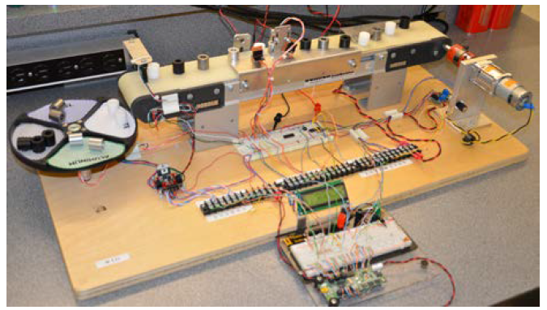

# Sorting Algorithm for Conveyor Belt

The goal of this project was to write an algorithm to sort cylinders in a conveyor belt in the least amount of time and with the least errors in sorting.

This was a class challenge to sort 48 cylinders (12 of each: steel, aluminum, white plastic, and black plastic).

The algorithm sorted the cylinders in 20 seconds with 4 errors.

## System Description

1. **Sorting bin** with four equally divided areas: steel, aluminum, white plastic, and black plastic.
2. **Bipolar stepper motor:** spins the sorting bin (located underneath the bin).
3. **DC motor:** runs the conveyor belt. Speed controllable by increasing the voltage.
4. **Sensors:** optical, reflective, and ferromagnetic sensors. 
5. **Microcontroller:** ATMEL Board AT90USBKey.

## Main Features

### Stepper Acceleration Profile
The algorithm incoporates a ramp-up and ramp-down profile to accelerate the rotational speed of the motor without stalling.

### Rotation Logic

 There was a great potential to save time if the stepper did not decelerate for every piece, because most sequences in the inspection could be done without decelerating. It was determined that the stepper only had to decelerate if it was going to switch directions or if two consecutive pieces were far apart. 

The algorithm knows at all times the material of the piece that currently has to be sorted as well as the material of the next piece to be sorted. With this information in hand, the system figures out if it needs to switch directions and stop. In the case that it does not have switch direction or stop, it would add the required steps to stepper motor. Immediately after the current piece falls into the tray, the system identifies the material of the next piece. This continuous addition of steps allows for a smooth rotation and maximum time efficiency.

